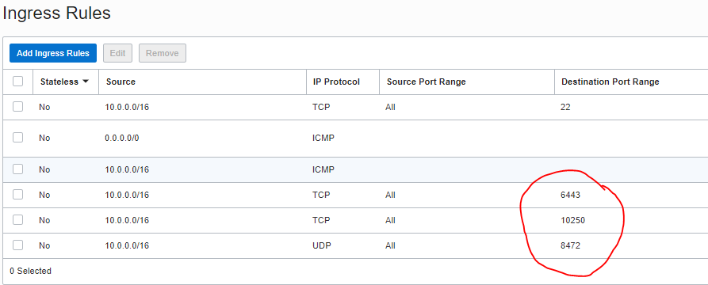

## Setting up kubernetes on Oracle cloud 

### Architecture

### Network
1. Create a compartment k8s
2. Create a VCN using the VCN wizard in the compartment k8s
3. The above network architecture will be automatically created with a public and private subnet

### Installation
1. Create a gateway server in the public subnet
2. Create 3 Oracle Linux 7.8 server in the private subnet. Name them as k8s-master, k8s-node-1 and k8s-node-2
3. Generate a public / private key pair if you do not have a SSH key pair
4. Supply the pre-generated SSH public key while creating the instances
   * The setup after the creation should look like 

**NOTE:** Perform the following steps for the master and the worker nodes 
#### SSH login to nodes from Gateway server
1. Create a private key file *vi ssh-key.key* and paste the content of the private key file 
2. Change the file mode to make is secure for the user trying to connect to *chmod 600 ssh-key.key*
3. *ssh -i ssh-key.key opc@private IP* 

#### Enable UEK5 and perform yum update 
This can take some time - about 15~20 minutes
<pre><code>sudo yum-config-manager --enable ol7_addons
sudo yum-config-manager --disable ol7_UEKR4
sudo yum-config-manager --enable ol7_UEKR5
sudo yum update -y</code></pre> 

#### Reboot the node 
<pre><code>sudo systemctl reboot</code></pre>

#### Check resource requirements 
1. Each node needs a minimum 2GB RAM and 2CPUs
2. A storage volume of at least 10GB is required for /var/lib/kubelet directory
<pre><code>sudo dmidecode -s system-uuid</code></pre>

#### Install docker 
<pre><code>sudo yum install docker-engine -y
sudo systemctl enable docker
sudo systemctl start docker
sudo systemctl status docker</code></pre>
Docker should be running after the above code executes successfully as shown below

#### Check Oracle container registry account 
1. Check https://container-registry.oracle.com to see if you can login through SSO userid and password
2. Check logging in with docker 
<pre><code>sudo docker login container-registry.oracle.com</code></pre>

#### Login as root 
<pre><code>sudo su -</code></pre>

#### Setup KUBE_REPO_PREFIX
<pre><code>docker login container-registry-phx.oracle.com
Username: <your email address>
Password: <Your container-registry password>
export KUBE_REPO_PREFIX=container-registry-phx.oracle.com/kubernetes
echo 'export KUBE_REPO_PREFIX=container-registry-phx.oracle.com/kubernetes' >> ~/.bashrc
cat ~/.bashrc</code></pre>

#### Install ntp server
<pre><code>sudo yum install ntp -y
sudo systemctl start ntpd
sudo systemctl enable ntpd
sudo systemctl status ntpd</code></pre>
ntpd service should be active and running after the code above executes successfully

#### Setup iptables and firewall configuration (perform as root)
<pre><code>iptables -P FORWARD ACCEPT
firewall-cmd --add-masquerade --permanent
firewall-cmd --add-port=10250/tcp --permanent
firewall-cmd --add-port=8472/udp --permanent
firewall-cmd --add-port=6443/tcp --permanent
systemctl restart firewalld
systemctl status firewalld</code></pre>
The firewalld service should be restarted and running. The time 2s shows that it has just restarted

#### Configure certain network requirements (perform as root)
<pre><code>lsmod|grep br_netfilter
modprobe br_netfilter
echo "br_netfilter" >> /etc/modules-load.d/br_netfilter.conf
echo "net.bridge.bridge-nf-call-ip6tables = 1" >> /etc/sysctl.d/k8s.conf
echo "net.bridge.bridge-nf-call-iptables = 1" >> /etc/sysctl.d/k8s.conf
/sbin/sysctl -p /etc/sysctl.d/k8s.conf</code></pre>

#### Setup SELINUX (perform as root)
/usr/sbin/setenforce 0
Edit the file /etc/selinux/config (you can use vi or nano editor), change the value as shown below and save the file 
SELINUX=Permissive

**NOTE:** Repeat the above steps for each one of the nodes until they are successfully completed.If you encounter failure, recreate the instance and start from the beginning

#### Setup Oracle cloud security lists (for private subnet)
1. Login to Oracle cloud
2. Go to Menu-->Networking-->Virtual Cloud Network & open up the k8s VCN
3. Click and open the private-subnet-k8s-vcn
4. Click and open the security-list-private-subnet-k8s-vcn
5. Create an ingress rule as shown below 

6. Create another ingress rule for destination port 10250
7. Create anaother ingress rule for destination port 8472 but choose UDP instead of TCP
8. The final picture after the addition should look like 

**NOTE:** DO THE FOLLOWING FOR THE MASTER NODE ONLY

#### Install and configure kubernetes (perform as root)
<pre><code>yum install kubeadm kubelet kubectl
kubeadm-setup.sh up</code></pre>
After successful installation - it should display as 

1. Exit out of root account, copy the code circled in blue and run in opc or any account you wish to run kubectl and connect to kubernetes
2. Copy the code spitted out in red and keep it in a safe place. You would need to run this for each node

#### Setup KUBECONFIG environment variable (perform as opc or non-root account)
export KUBECONFIG=$HOME/.kube/config
echo 'export KUBECONFIG=$HOME/.kube/config' >> $HOME/.bashrc

#### Verify the kubernetes install
<pre><code>kubectl get pods -n kube-system</code></pre>
1. It should display all the pods in the kubs-system namespace

**NOTE:** DO THE FOLLOWING FOR THE WORKER NODES ONLY

### Reference
* [Oracle k8s install guide](https://docs.oracle.com/en/operating-systems/oracle-linux/kubernetes/kubernetes_install_upgrade.html)
